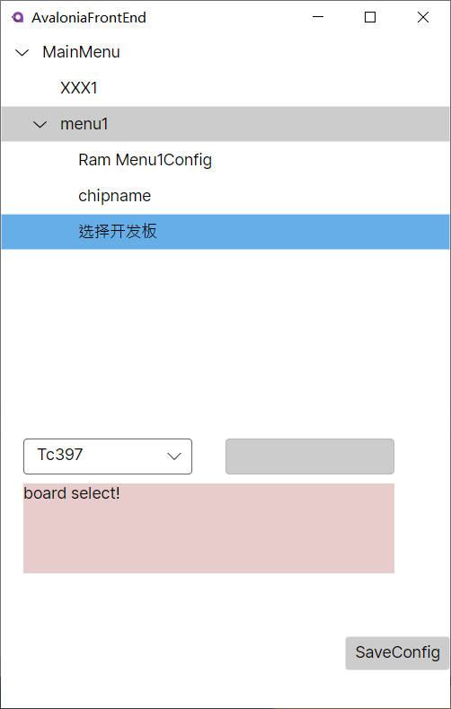

# 使用C#做脚本代替KConfig、makefile,持续开发中,估计会烂尾.原型验证是可以的。



编译:
1.VS2022安装Avalonia for VS2022 扩展。
2.编译csmake仓库
3.F5调试。他会使用$root\CSConfigSln\csmake\bin\Debug\net7.0\CsConfigDescription.cs作为脚本(类似于kconfig脚本)输入，渲染一个tree
4.非调试运行：$root\CSConfigSln\csmake\bin\Debug\net7.0> .\csmake.exe CsConfig -d CsConfigDescription.cs -u 33.json

编写一个demo:主菜单名为demo,demo中有三个项a,b,c,其中c=a+b,c使用16进制表示
```
using CSConfig;
using System;
using csmake;
[MainMenu]
public class DemoMainMenu : IMenu
{
    public string Name =>"demo";
    public static DemoMainMenu gInstnace{get;set;}=new DemoMainMenu();
    [ItemConfig]
    public Config A{get;set;}=new Config() { ConfigType = ConfigType.Int, Name = "A", Value = (Int64)1};
    [ItemConfig]
    public Config B{get;set;}=new Config() { ConfigType = ConfigType.Int, Name = "B", Value = (Int64)1};
    [ItemConfig]
    public Config C{get;set;}=new Config() { ConfigType = ConfigType.Int, Name = "C", Value = (Int64)1,IsHexShow=true};
    public void ItemValueChanged(IItem cfg)
    {
        if(cfg==A ||cfg==B)
        {
            C.Value=(Int64)A.Value+(Int64)B.Value;
        }
    }
}
```
保存为test.json
输入命令.\csmake.exe CsConfig -d test.cs   这里没有-u xxx.json 是因为我们没有默认的用户配置文件。
如图所示.


经过大脑的运算，这个等价于kconfig,可以将kconfig转成cs脚本。

接下来做的事：
csmake 代替make :初步设计: 
1.csmake build -i XXX1.cs其中XXX1.cs类似于makefile，
2.如果不写-i ，也就是csmake build 他将默认找csmake.cs作为输入。
3.csmake.cs描述了又多少个.c /cpp 以及每个头文件路径，还有排除项，还有用什么编译器编译，比如GNU？
    比如预定义宏(-D)通过这个csmake.cs就能获取这些。
4.获取到之后,如果命令行是csmake  build 没有其他的，name将csmake.cs的工具链作为编译工具链.
    如果命令行是csmake build --toolchain "MSVC",那么将忽略csmake.cs的关于工具链的描述内容。

总体思想是
# 1.csmake.cs描述了要编译的所有资源，如源码文件，头文件 工具链，链接脚本，输出目录，输出文件名，BuildAfter事件等等。
# 2.命令行这边，主要是覆盖csmake.cs的内容，比如增加预定义宏，替换工具链。
还有什么 大家想想？
主要要设计好这个模型！


